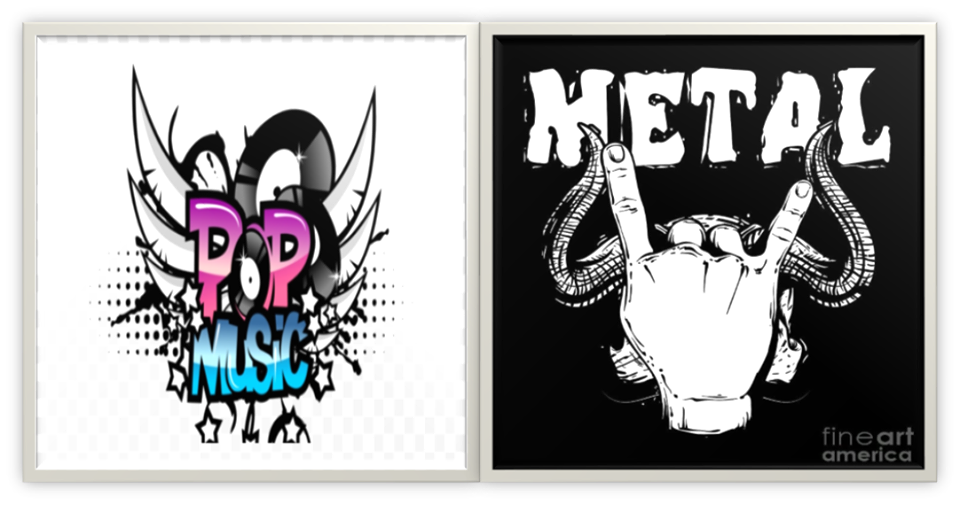
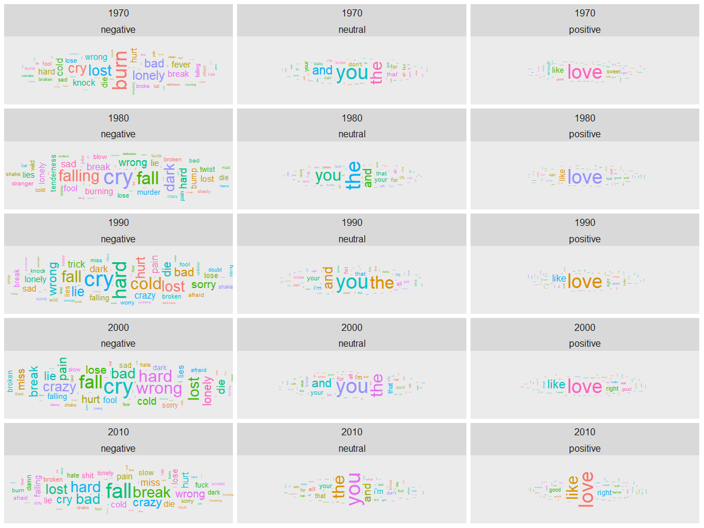
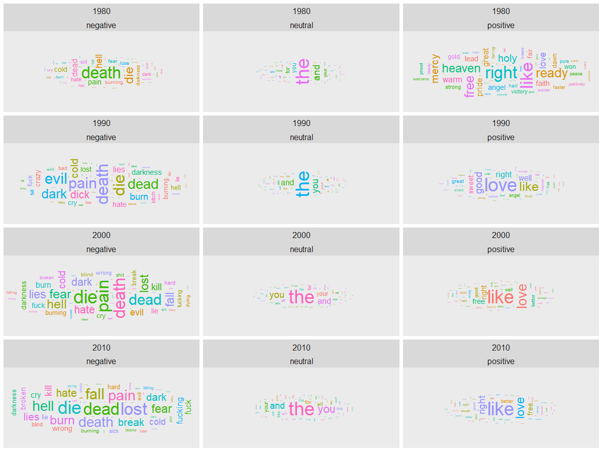
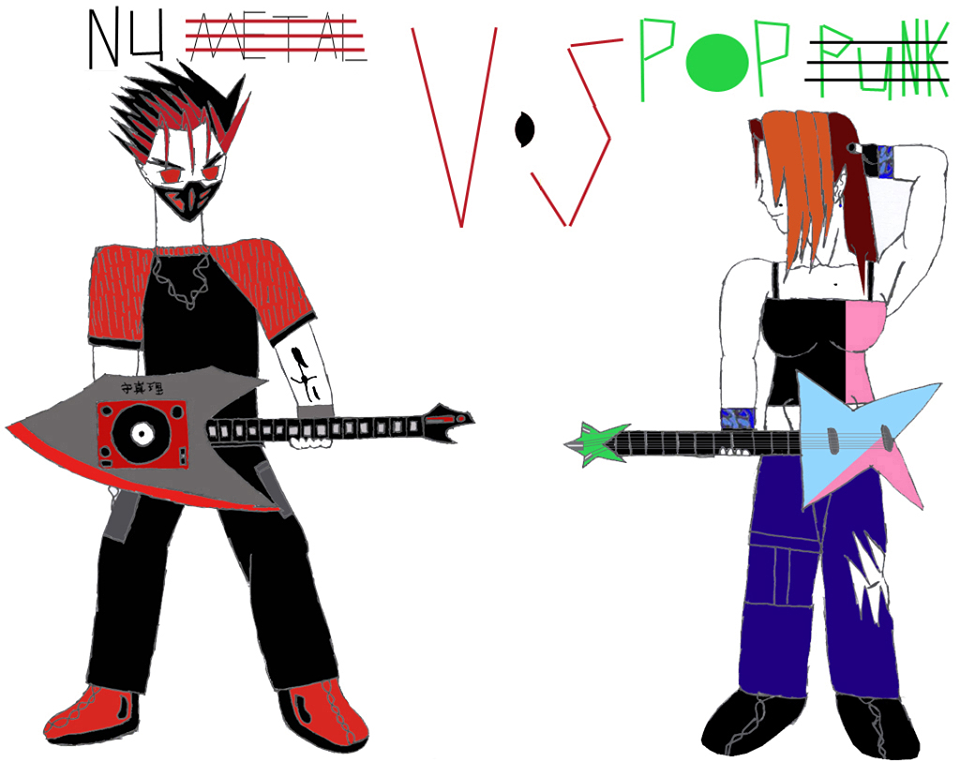

#### This report is a guidebook with selected Q&A aims at finding out the insights and differences between Pop and Metal.

#### The whole dataset: "lyrics.Rdata" is a filtered corpus of 380,000+ song lyrics from MetroLyrics. You can read more about it on [Kaggle](https://www.kaggle.com/gyani95/380000-lyrics-from-metrolyrics). "info_artist.csv" provides the background information of all the artists. This information is scraped from [LyricsFreak](https://www.lyricsfreak.com/).

```{r, warning=FALSE, message=FALSE,echo=FALSE}
knitr::opts_chunk$set(echo = TRUE)
```

#### Setup used packages 
```{r, message=FALSE, warning=FALSE}
packages.used=c("tm", "tidytext","tidyverse","DT","wordcloud","scales","gridExtra","ngram","igraph","ggraph","rsconnect", "syuzhet", "ggwordcloud")

# check packages that need to be installed.
packages.needed=setdiff(packages.used, 
                        intersect(installed.packages()[,1], 
                                  packages.used))
# install additional packages
if(length(packages.needed)>0){
  install.packages(packages.needed, dependencies = TRUE)
}

# load packages
library(dplyr)
library(stringr)
library(tm)
library(tidytext)
library(tidyverse)
library(DT)
library(wordcloud)
library(scales)
library(gridExtra)
library(ngram)
library(igraph)
library(ggraph)
library(rsconnect)
library(data.table)
library(scales)
library(shiny) 
library(syuzhet)
library(ggwordcloud) 
```


#### First,I processed the raw textual data 'dt_lyrics' saved in $ data $ file by cleaning data, removing stopwords and creating a tidy version of texts which is saved in $ output $ file as 'processed_data'. Then I load the processed data directly from output folder. 

#### This report is prepared using the processed_lyrics that is saved in the output file. 

```{r load data, warning=FALSE, message=FALSE}
# Load the processed text data along with artists information on contributors

# load lyrics data
load('../output/processed_lyrics.RData') 
# load artist information
dt_artist <- fread('../data/artists.csv') 
```

### What are the music trends of Pop and Metal in general? Is pop really more positive than metal? 

In the music industry, there has always been a comparison between pop and metal since they are polar opposites. From the artists  and their performance styles to the lyrics and the rhythm, these genres do not have much in common. Furthermore, they also have very different types of fans who take pride in the genre they prefer and have a disdain for the other. 

I have always been curious about the differences between pop and metal music. As we all know, pop music is usually known as more emotional, romantic, and soft while metal music tends to be more intense, virtuosic, and powerful. I feel like this difference would be interesting to compare the two totally different definitions and styles of genres to see if there are any insights we could learn more about. 

I started with the general idea of how both of the genres have performed historically through their total number of songs and artists. 


```{r}

## Number of pop songs and artists per decade

##Adding Decade information

dt_lyrics$decade <- paste(str_sub(dt_lyrics$year, 1, 3), '0', sep = '')

temp  <- group_by(dt_lyrics, decade) %>% 
            filter(genre %in% c("Pop")) %>% 
            summarise(songs = n(),
                      artists = length(unique(artist))) %>% 
            arrange(desc(decade))

ggplot(data = temp, aes(x = decade, y = songs)) +
    geom_bar(stat = 'identity', aes(fill = decade)) +
    geom_label(aes(label = paste('songs:', songs, '\nartists: ', artists, sep = ''),
                   y = 1000, fill = decade), size = 4, hjust = 'left', alpha = 0.25) +
    coord_flip() +
    xlab('Decade') +
    ylab('') +
    labs(title = '                                  Total Pop Songs and Artists by Decade') +
    theme(legend.position = 0,
         text = element_text(size = 10),
         axis.text.x = element_blank())
```


```{r}

## Number of pop songs and artists per decade

temp1  <- group_by(dt_lyrics, decade) %>% 
            filter(genre %in% c("Metal")) %>% 
            summarise(songs = n(),
                      artists = length(unique(artist))) %>% 
            arrange(desc(decade))

ggplot(data = temp1, aes(x = decade, y = songs)) +
    geom_bar(stat = 'identity', aes(fill = decade)) +
    geom_label(aes(label = paste('songs:', songs, '\nartists: ', artists, sep = ''),
                   y = 1000, fill = decade), size = 4, hjust = 'left', alpha = 0.25) +
    coord_flip() +
    xlab('Decade') +
    ylab('') +
    labs(title = '                                  Total Metal Songs and Artists by Decade') +
    theme(legend.position = 0,
         text = element_text(size = 10),
         axis.text.x = element_blank())
```

According to the above charts, pop music began earlier than metal music and started in the 1970s. Furthermore, pop music did not only start earlier, but also was more active during its early stage. Both of the genres rapidly increased the number of songs and artists in the genre beginning in the 2000s.Even though they both seemed to decrease greatly in the 2010s, it can not be concluded that they have been less active due to the latest year of the dataset being 2016. 

To have a better general understanding of the nature in both genres, I tried to figure out the most used words in each genre. The two separate word clouds show the most used words in pop and metal respectively.


```{r, warning=FALSE, message=FALSE}
pop_song <- dt_lyrics[dt_lyrics$genre == "Pop",]

bag_of_words_pop_song <-  pop_song %>%
  unnest_tokens(word, stemmedwords)

word_count_pop_song <- bag_of_words_pop_song %>%
  count(word, sort = TRUE)
```


```{r,message=FALSE,warning=FALSE}
wordcloud(word_count_pop_song$word,word_count_pop_song$n,
          scale=c(5,0.2),
          max.words=100,
          min.freq=2,
          random.order=FALSE,
          rot.per=0.5,
          use.r.layout=T,
          random.color=FALSE,
          colors=brewer.pal(9,"Blues"))
```

```{r, warning=FALSE, message=FALSE}
metal_song <- dt_lyrics[dt_lyrics$genre == "Metal",]

bag_of_words_metal_song <-  metal_song %>%
  unnest_tokens(word, stemmedwords)

word_count_metal_song <- bag_of_words_metal_song %>%
  count(word, sort = TRUE)

```


```{r,message=FALSE,warning=FALSE}
wordcloud(word_count_metal_song$word,word_count_metal_song$n,
          scale=c(5,0.2),
          max.words=100,
          min.freq=2,
          random.order=FALSE,
          rot.per=0.5,
          use.r.layout=T,
          random.color=FALSE,
          colors=brewer.pal(9,"Greens"))
```


As we can see above, the Pop genre mostly uses softer emotion words (love, baby, time, heart, ill, etc.). The word "love" especially was used far greater than the other most used words in the genre, resulting in its larger size and darker color compared to other words in the cloud. In contrast, even though the metal genre has positive words (live, love, dream), it has used more dark words compared to pop (fear, lost, dead, burn, dies, dark, etc.). Also, the frequency of words used in the metal genre is closer to each other as the metal word cloud shows a great variety of words and the size and color of these words are similar. 

### Who are the hardest working artists in these genres? Did they follow the trends? Or did they write their music using their own style? 

In order to have a deeper understanding of the genres, I consider the hardest working artists of pop and metal by counting the total number of songs per artist in each genre and showing the result of the top ten most prolific artists of all time in both. 


```{r,message=FALSE,warning=FALSE}
temp2 <- count(dt_lyrics, genre, artist, sort = TRUE) %>% 
  group_by(genre) %>% 
  arrange(desc(n)) %>% 
  filter(row_number() <= 10) %>% 
  arrange(desc(genre), desc(n)) %>%
  filter(genre %in% c("Pop"))

ggplot(temp2, aes(artist, n))+
      geom_col() +
      labs(title = "                       The Most Prolific Pop Artists of All Time")+
      xlab(NULL) +
      ylab("Number of songs")+
      coord_flip()
``` 


For the pop genre, the Bee Gees have the highest total number of songs (almost 600 songs) and Barbra Streisand is only a little bit below the first. The 10th artist on the list goes to Gary Numan with about 230 songs.

```{r,message=FALSE,warning=FALSE}
temp3 <- count(dt_lyrics, genre, artist, sort = TRUE) %>% 
  group_by(genre) %>% 
  arrange(desc(n)) %>% 
  filter(row_number() <= 10) %>% 
  arrange(desc(genre), desc(n)) %>%
  filter(genre %in% c("Metal"))

ggplot(temp3, aes(artist, n))+
      geom_col() +
      labs(title = "                       The Most Prolific Metal Artists of All Time")+
      xlab(NULL) +
      ylab("Number of songs")+
      coord_flip()
``` 

For the metal genre, Fall has the highest total number of songs (about 300 songs) and has a far greater distance compared to other artists in the chart above. The 10th artist is Acid Drinkers with about 110 songs. 


Overall, with the given dataset, the most prolific artists in the pop genre are more active than the metal genre. The most prolific artist in the pop genre has produced about two times as many songs as the number one artist in metal. Furthermore, the 10th artist in pop also has produced about two times the number that the 10th artist in metal has. 


Now, it is interesting to see if these most prolific artists followed the trends of their genre. I used the word clouds to show the most used words by these artists and see if there are any differences compared to the general themes of their genre. 


```{r, warning=FALSE, message=FALSE}
pop_singers <- count(dt_lyrics, genre, artist, stemmedwords, sort = TRUE) %>% 
                group_by(genre) %>% 
                arrange(desc(n)) %>% 
                filter(row_number() <= 10) %>% 
                arrange(desc(genre), desc(n)) %>%
                filter(genre %in% c("Pop"))

bag_of_words_pop_song_artirst <-  pop_singers %>%
  unnest_tokens(word, stemmedwords)

word_count_pop_song_artist <- bag_of_words_pop_song_artirst %>%
  count(word, sort = TRUE)
```

```{r,message=FALSE,warning=FALSE}
wordcloud(word_count_pop_song_artist$word,word_count_pop_song_artist$n,
          scale=c(5,0.2),
          max.words=100,
          min.freq=2,
          random.order=FALSE,
          rot.per=0.5,
          use.r.layout=T,
          random.color=FALSE,
          colors=brewer.pal(9,"Blues"))
```

For the pop genre, the artists used the word "blame" the most while in general the word "love" was used most. Even though "love" was still very often, these top artists have used vocabularies with more varied emotions, such as “miss”, “pain”, “cry”, “lie””, “broke”, etc. Therefore, the most prolific pop artists did not seem to follow the music genre in general, but tended to create their own styles and express different emotions in their songs.


```{r, warning=FALSE, message=FALSE}
metal_singers <- count(dt_lyrics, genre, artist, stemmedwords, sort = TRUE) %>% 
                group_by(genre) %>% 
                arrange(desc(n)) %>% 
                filter(row_number() <= 10) %>% 
                arrange(desc(genre), desc(n)) %>%
                filter(genre %in% c("Metal"))

bag_of_words_metal_song_artist <-  metal_singers %>%
  unnest_tokens(word, stemmedwords)

word_count_metal_song_artist <- bag_of_words_metal_song_artist %>%
  count(word, sort = TRUE)
```

```{r,message=FALSE,warning=FALSE}
wordcloud(word_count_metal_song_artist$word,word_count_metal_song_artist$n,
          scale=c(5,0.2),
          max.words=100,
          min.freq=2,
          random.order=FALSE,
          rot.per=0.5,
          use.r.layout=T,
          random.color=FALSE,
          colors=brewer.pal(9,"Greens"))
```

For the metal genre, the top artists used the top three words (life, time, youre) similar to the genre as a whole. However, it looks like the artists also used a greater variety of words that were not used a lot in the genre (beat, slip, insides, path, leave) and new words (avantasia). Therefore, the metal artist's song lyrics seem to follow the trends of the genre more closely than pop, but these artists also have their own creativity and different emotional impressions in their lyrics.

### How did the sentiments in Pop and Metal change over the decades and how do they compare to each other?

From the figures above, we know how both genres are in general. Besides the most used words in general, it would be more informative to see how these genres have changed over the decades using sentiment analysis. 

In this question, I would like to see how the sentiments differ using the bing sentiment lexicon. From the package’s description,  "The bing emotion is a list of English words and their associations with three basic emotions (negative, positive, neutral)."

Let's begin with the Pop genre.


```{r,message=FALSE,warning=FALSE,include=FALSE}

lyrics_token_pop <- unnest_tokens(dt_lyrics,
                              input = lyrics,
                              output = word,
                              token = 'words',
                              drop = TRUE,
                              to_lower = TRUE)
lyrics_token_pop <- filter(lyrics_token_pop,
                       str_detect(word, '^[a-z]') &
                       (genre %in% c("Pop")) &
                       nchar(word) >= 3)

bing = get_sentiments('bing')
lyrics_token_pop$sentiment = plyr::mapvalues(lyrics_token_pop$word, 
                                         bing$word, bing$sentiment, 
                                         warn_missing = FALSE)

lyrics_token_pop$sentiment = if_else(!(lyrics_token_pop$sentiment %in% c('positive', 'negative')), 
                                    'neutral', lyrics_token_pop$sentiment)

sample_n(lyrics_token_pop, size = 15)

count_words <- count(lyrics_token_pop, word, sentiment, sort = TRUE)

```

```{r,message=FALSE,warning=FALSE}
gw <- group_by(lyrics_token_pop, decade, sentiment, word) %>%
  summarise(gw_c = n()) %>% 
  ungroup() %>% 
  group_by(decade) %>%
  mutate(gw_p = gw_c / sum(gw_c)) %>% 
  ungroup() %>%
  arrange(decade, desc(gw_p)) %>% 
  group_by(word) %>% 
  mutate(w_c = sum(gw_c))

w <- group_by(lyrics_token_pop, sentiment, word) %>%
  summarise(w_c = n()) %>% 
  ungroup() %>%
  mutate(w_p = w_c / sum(w_c)) %>%
  arrange(desc(w_c))
```

```{r,message=FALSE,warning=FALSE, include=FALSE}
## World cloud sentiment in pop

temp4 <- group_by(gw, decade, sentiment) %>%  
    arrange(desc(gw_p)) %>% 
    filter(row_number() < 60) %>%
    mutate(angle = 90 * sample(c(0, 1), n(), replace = TRUE, prob = c(70, 30)), 
           freq_sd = (gw_c - min(gw_c)) / (max(gw_c) - min(gw_c))) %>% 
    ungroup()

options(repr.plot.width = 10, repr.plot.height = 40)

plt1 <- ggplot(data = temp4,
  aes(label = word, 
      size = freq_sd,
      color = factor(sample.int(10, nrow(temp4), replace = TRUE)), 
      angle = angle)) +
  geom_text_wordcloud_area() +
  scale_size_area(max_size = 10) +
  facet_wrap(decade ~ sentiment, nrow = 5) +
  theme(text = element_text(size = 15))

#Run the follwing line in console for better plot sizing  because the figure is constrained in size in R note book. 

suppressWarnings(print(plt1)) 

# The image below is saved in fig folder after running the code through console. 
```




According to the figure above, pop music has not changed much in neutral and positive sentiment since the 1970s to the 2010s. In these two sentiments, the word clouds of each decade show similar lists of most used words. However, in the negative sentiment, the most used words were different from each decade. For example, the top three most used words with negative sentiments in the 1970s are "burn", "lost", and "lonely", while the top three most used words in the 1980s are "cry", "falling", and "fall". Also, in the 2010s, some curse words began to be used more often in the genre.


Now, let's take a look at the Metal genre.


```{r,message=FALSE,warning=FALSE,include=FALSE}
#The bing emotion is a list of English words and their associations with three basic emotions (negative, positive, neutral)

lyrics_token_metal <- unnest_tokens(dt_lyrics,
                              input = lyrics,
                              output = word,
                              token = 'words',
                              drop = TRUE,
                              to_lower = TRUE)

lyrics_token_metal <- filter(lyrics_token_metal,
                       str_detect(word, '^[a-z]') &
                       (genre %in% c("Metal")) &
                       nchar(word) >= 3)

bing = get_sentiments('bing')
lyrics_token_metal$sentiment = plyr::mapvalues(lyrics_token_metal$word, 
                                         bing$word, bing$sentiment, 
                                         warn_missing = FALSE)

lyrics_token_metal$sentiment = if_else(!(lyrics_token_metal$sentiment %in% c('positive', 'negative')), 
                                    'neutral', lyrics_token_metal$sentiment)

sample_n(lyrics_token_metal, size = 15)

count_words <- count(lyrics_token_metal, word, sentiment, sort = TRUE)

```

```{r,message=FALSE,warning=FALSE,echo=FALSE}
gw1 <- group_by(lyrics_token_metal, decade, sentiment, word) %>%
  summarise(gw_c = n()) %>% 
  ungroup() %>% 
  group_by(decade) %>%
  mutate(gw_p = gw_c / sum(gw_c)) %>% 
  ungroup() %>%
  arrange(decade, desc(gw_p)) %>% 
  group_by(word) %>% 
  mutate(w_c = sum(gw_c))

w1 <- group_by(lyrics_token_metal, sentiment, word) %>%
  summarise(w_c = n()) %>% 
  ungroup() %>%
  mutate(w_p = w_c / sum(w_c)) %>%
  arrange(desc(w_c))
```


```{r,message=FALSE,warning=FALSE, include=FALSE}
## Word cloud sentiment in Metal

temp5 <- group_by(gw1, decade, sentiment) %>%  
    arrange(desc(gw_p)) %>% 
    filter(row_number() < 60) %>%
    mutate(angle = 90 * sample(c(0, 1), n(), replace = TRUE, prob = c(70, 30)), 
           freq_sd = (gw_c - min(gw_c)) / (max(gw_c) - min(gw_c))) %>% 
    ungroup()

options(repr.plot.width = 10, repr.plot.height = 40)

plt1 <- ggplot(data = temp5,
  aes(label = word, 
      size = freq_sd,
      color = factor(sample.int(10, nrow(temp5), replace = TRUE)), 
      angle = angle)) +
  geom_text_wordcloud_area() +
  scale_size_area(max_size = 10) +
  facet_wrap(decade ~ sentiment, nrow = 5) +
  theme(text = element_text(size = 15))

#Run the follwing line in console for better plot sizing  because the figure is constrained in size in R note book. 

suppressWarnings(print(plt1)) 

# The image below is saved in fig folder after running the code through console. 
```




In the metal genre, the positive sentiment is changed often  and becomes more simplified after the 1980s. As we can see, there are greater variations in vocabulary in the 1980s, and “love” was not used very often. This result can be because of the early stages of the genre, where there were not a lot of metal songs and artists. Since 1990, the positive sentiments of each decade are fairly similar in metal.

The negative sentiment of metal shows that there is an increasing number of vocabulary used with the words being relatively similar over time. Besides using intense words, this genre also uses many curse words. 

So how do pop and metal music compare to each over time? 

In comparison, pop music has very simple words used in positive and neutral sentiments, but has greater diversity and emotionality in negative sentiments. Conversely, metal also has simple words, but with a far greater variety in positive and neutral sentiments, but are fairly similar in the negative sentiment. Furthermore, metal music used more heavy, intense, and darker words in their lyrics. 





### Conclusions

1. In general, the pop genre is more active compared to the metal genre with more songs and artists per decade. Furthermore, pop lyrics use more soft emotion words in their lyrics and do not have a lot of heavy, intense words in their songs. Metal lyrics also have some positive words in their songs, but tend to use darker words more frequently. 

2. The most prolific artists for each genre did create their own styles in their songs. They did not follow the trends of the genres as much, but varied their word use and moved away from the general trends. 

3. Historically, pop and metal music had similar frequency of words used in all three sentiments (positive, neutral, and negative). However, they both had greater diversity of words in the negative sentiment. Also, metal music had more intense, darker, and heavy words in their lyrics. In the 2010s, some curse words began to be used more often in pop, while they had always been present in metal historically.


